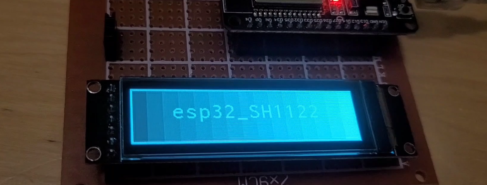
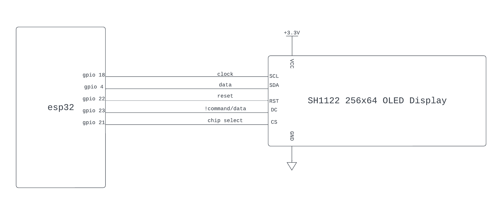

<a name="readme-top"></a>

<summary>Table of Contents</summary>
<ol>
<li>
    <a href="#about">About</a>
</li>
<li>
    <a href="#getting-started">Getting Started</a>
    <ul>
    <li><a href="#wiring">Wiring</a></li>
    <li><a href="#adding-to-project">Adding to Project</a></li>
    </ul>
</li>
<li><a href="#example">Example</a></li>
<li><a href="#documentation">Documentation</a></li>
<li><a href="#acknowledgements">Acknowledgements</a></li>  <!-- Added this line -->
<li><a href="#license">License</a></li>
<li><a href="#contact">Contact</a></li>
</ol>

## About

esp32_SH1122 is a C++ esp-idf v5.x component, intended to serve as a driver for SH1122 driven 256x64 OLED displays with 16 shades of grayscale.  
This library contains functions for basic graphics like lines, rectangles, and ellipses. It also contains support
for strings and bitmaps.  
The font system is a port of U8G2's font system, with close to 2000 different fonts to choose from, as well as support for custom fonts. This repo also contains tools to convert images to a bitmap format suitable for the SH1122.

## Getting Started
<p align="right">(<a href="#readme-top">back to top</a>)</p>

### Wiring
The default wiring is depicted below, it can be changed at driver initialization (see example section).

<p align="right">(<a href="#readme-top">back to top</a>)</p>

### Adding to Project
1. Create a "components" directory in the root workspace directory of your esp-idf project if it does not exist already.  

   In workspace directory:     
   ```sh
   mkdir components
   ```


2. Cd into the components directory and clone the esp32_SH1122 repo.

   ```sh
   cd components
   git clone https://github.com/myles-parfeniuk/esp32_SH1122.git
   ```

3. Ensure you clean your esp-idf project before rebuilding.  
   Within esp-idf enabled terminal:
   ```sh
    idf.py fullclean
   ```
<p align="right">(<a href="#readme-top">back to top</a>)</p>

### Example
This example draws a string on a dark gray background.
```cpp  
#include <stdio.h>
#include "SH1122Oled.hpp"
#include "fonts/sh1122_font_inr16_mf.hpp" //include any fonts you wish to use

extern "C" void app_main(void)
{
    SH1122Oled oled; //using default initialization

    //custom initialization example:
    /*SH1122Oled oled(sh1122_oled_cfg_t(SPI3_HOST, //SPI peripheral
                                        GPIO_NUM_4, //sda GPIO
                                        GPIO_NUM_18, //sclk GPIO
                                        GPIO_NUM_21, //chip select GPIO
                                        GPIO_NUM_22, //reset GPIO
                                        GPIO_NUM_23) //data/!command GPIO
                                        );
    */

    while (1)
    {

        oled.clear_buffer(); // clear buffer of previous frame before drawing

        // draw background
        oled.draw_rectangle(0, 0, SH1122Oled::WIDTH, SH1122Oled::HEIGHT, SH1122Oled::PixelIntensity::level_1);

        // draw screen border
        oled.draw_rectangle_frame(0, 0, SH1122Oled::WIDTH, SH1122Oled::HEIGHT, 2, SH1122Oled::PixelIntensity::level_10);

        // draw the string
        SH1122Oled::load_font(sh1122_font_inr16_mf); // load font for drawing string
        const int x = oled.font_get_string_center_x("esp32_SH1122");  // find the string x position for horizontal centering
        const int y = oled.font_get_string_center_y("esp32_SH1122");  // find the string y position for vertical centering
        oled.draw_string(x, y, SH1122Oled::PixelIntensity::level_15, "esp32_SH1122"); 

        oled.update_screen(); // send the current buffer to the screen

        vTaskDelay(50 / portTICK_PERIOD_MS);
    }
}
```
<p align="right">(<a href="#readme-top">back to top</a>)</p>

## Documentation
API documentation generated with doxygen can be found in the documentation directory of the master branch.  
<p align="right">(<a href="#readme-top">back to top</a>)</p>


## Acknowledgements
Thanks to Oliver Krause and contributors of u8g2.  
https://github.com/olikraus/u8g2  
This library utilizes the same run-line encoding system used by U8G2 for fonts.  
<p align="right">(<a href="#readme-top">back to top</a>)</p>

## License

Distributed under the MIT License. See `LICENSE.md` for more information.
<p align="right">(<a href="#readme-top">back to top</a>)</p>

## Contact

Myles Parfeniuk - myles.parfenyuk@gmail.com

Project Link: [https://github.com/myles-parfeniuk/esp32_SH1122.git](https://github.com/myles-parfeniuk/esp32_SH1122.git)
<p align="right">(<a href="#readme-top">back to top</a>)</p>